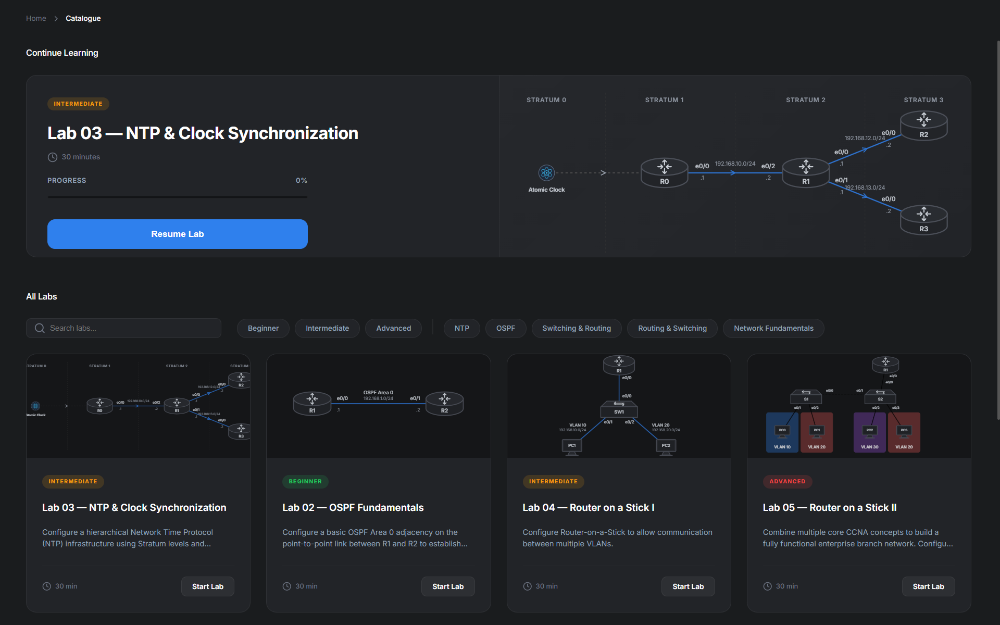
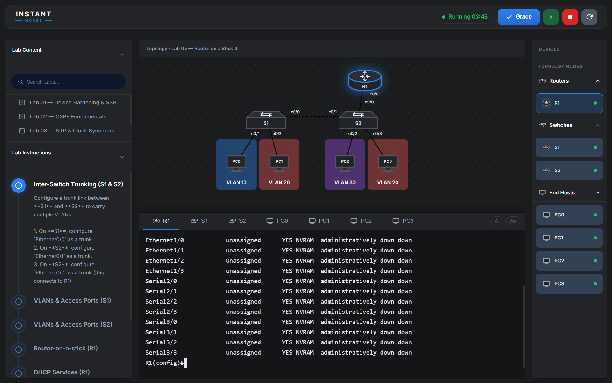
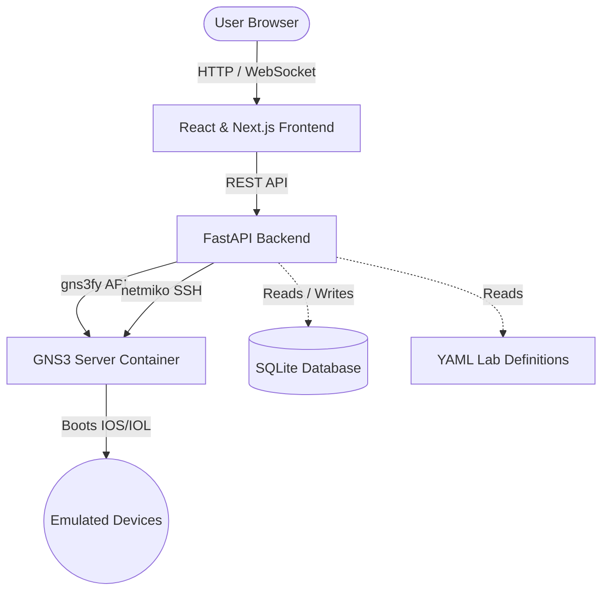

<div align="center">
  

  <p>
    InstantNodes is a browser-based CCNA lab environment running on top of GNS3. It abstracts away the complex setup of network emulation by providing a unified web interface for topologies, SSH terminals, and automated configuration grading.
  </p>

  <p>
    <a href="#license"></a>
    <a href="#quick-start"></a>
    <a href="#project-status"></a>
  </p>
</div>

---

## Overview

<div align="center">
  
  <br>
  
</div>

Setting up traditional network emulators can be frustrating and time-consuming. InstantNodes solves this by containerizing GNS3 and exposing a React frontend. You supply your own Cisco IOS/IOL images, and the platform handles the rest.

- **Automated Grading Engine**: Configures devices in-browser. The Python backend (using Netmiko) connects via SSH, pulls running configurations, and evaluates them against a known-good solution file.
- **In-Browser Terminal**: A native `xterm.js` terminal connects to router consoles via WebSockets. No external SSH clients required.
- **Interactive Topologies**: Dynamic, SVG-based network diagrams that clearly map out VLANs, trunks, and active interfaces.
- **Local Execution**: The entire stack runs in Docker Compose on your local machine.

## Architecture

InstantNodes runs as three coordinated Docker containers.



## Quick Start

### Prerequisites

- Docker Desktop
- Cisco IOS/IOL `.bin` or `.image` files

> **Note:** Cisco images are not distributed with this project. You must supply your own images.

### 1. Clone the repository

```bash
git clone https://github.com/DiptanshuDhawan/NetSimX.git
cd NetSimX
```

### 2. Add your Cisco images

Place your images into the `./images` directory at the repository root. This folder is mounted directly into the GNS3 server container.

**Important:** Rename your Layer 3 image to `router.bin` and your Layer 2 image to `switch.bin`.

```
NetSimX/
└── images/
    ├── router.bin
    └── switch.bin
```

### 3. Launch the stack

```bash
docker-compose up -d --build
```

The initial run will build the frontend and backend containers. Once complete, the application will be available at `http://localhost:3000`.

### 4. Shutting down

```bash
docker-compose down
```
Lab progress and grading history are persisted in a local SQLite database stored in a Docker volume.

## Authoring Labs

Labs are defined using YAML and reference configurations. No application code modifications are required to add new labs.

```
labs/
└── inter-vlan-routing/
    ├── lab.yaml        # Topology layout, instructions, and metadata
    └── solution.cfg    # Reference configuration for the grading engine
```

Review the existing examples in the `/labs` directory to use as templates for creating new scenarios.

## Project Status

InstantNodes is currently in active beta. The core grading engine, Docker Compose stack, and frontend UI are fully functional. Current work is focused on expanding the built-in lab library to cover the full CCNA 200-301 blueprint.

## License

Distributed under the MIT License. See `LICENSE` for details.
